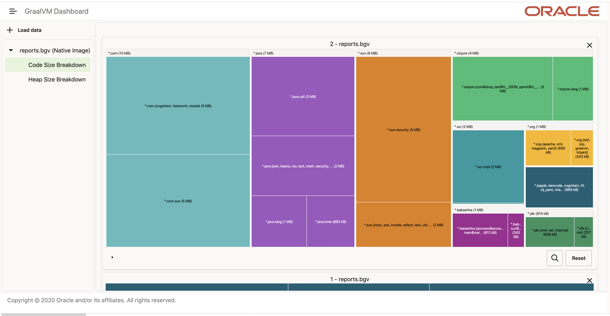

= clj-graal-docs
:idprefix:
:idseparator: -
:toc:

== Rationale

This little repo's goal is to collect scripts and tips on natively compiling Clojure programs with https://www.graalvm.org/[GraalVM].

GraalVM offers the ability to compile Java classes to native binaries.
Because Clojure is hosted on the https://en.wikipedia.org/wiki/Java_virtual_machine[JVM], compiling Clojure  programs to native binaries is also, to some extent, possible.

Native binaries offer fast startup times and are therefore an attractive option for command line tools that are used in scripting and editor integration.
Popular examples are https://github.com/borkdude/babashka[babashka] and https://github.com/borkdude/clj-kondo[clj-kondo], see link:doc/external-resources.md[resources] for many more examples.

We mostly keep our tips related to Clojure, but will sometimes we'll add something just because we didn't easily find it elsewhere, and we feel it would be helpful to others.

Unless otherwise indicated, when we refer to GraalVM in this repository, we are referring to the https://github.com/oracle/graal/blob/master/substratevm/README.md[Graal Substrate VM].
The Substrate VM is exposed as the https://www.graalvm.org/docs/reference-manual/native-image/[GraalVM native compiler].

If you are trying to decide if GraalVM is for you, the trade-offs are nicely explained by Oleg Šelajev in the https://youtu.be/PeMvksAZbdw?t=647["AOT vs JIT" section of his "Maximizing Java Application Performance with GraalVM video"].

== Community

> 👋 Need help or want to chat?
> Say hi on http://clojurians.net/[Clojurians Slack] in https://clojurians.slack.com/app_redirect?channel=graalvm[#graalvm].

This is a team effort.
We heartily welcome, and greatly appreciate, tips, tricks, corrections and improvements from you.
Much thanks to all who have contributed.

Style guidance:

- please write https://asciidoctor.org/docs/asciidoc-recommended-practices/#one-sentence-per-line[one sentence per line].
- to cut down on frustrating whitespace diffs, we have added an link:.editorconfig[.editorconfig] file.
Your editor https://editorconfig.org#download/[will likely automatically pick this config up].

The current curators of this repository are: https://github.com/borkdude[@borkdude] and https://github.com/lread[@lread].

== link:doc/hello-world.md[Hello world]

== Tips and tricks

=== Clojure version

Use https://clojure.org/community/devchangelog[the current Clojure v1.10 release], it includes several GraalVM specific fixes, including:

* https://clojure.atlassian.net/browse/CLJ-1472[CLJ-1472] - locking macro creates monitor bytecode difficult to analyze in Graal native-image and ART runtime. +
For prior versions of Clojure, link:CLJ-1472/README.md[we documented how to patch and work around this issue].
* https://clojure.atlassian.net/browse/CLJ-2502[CLJ-2502] - Cannot use clojure.stracktrace/print-stack-trace with GraalVM.
* https://clojure.atlassian.net/browse/CLJ-2571[CLJ-2571] - ex-cause is missing Throwable return tag.
* https://clojure.atlassian.net/browse/CLJ-2572[CLJ-2572] - Prevent reflection in clojure.data namespace, make compatible with GraalVM.

Other fixes of interest are:

* https://clojure.atlassian.net/browse/CLJ-2582[CLJ-2582] - Improve GraalVM native image size / compile time memory consumption when compiling clojure.pprint
* https://clojure.atlassian.net/browse/TCHECK-157[TCHECK-157] - Randomization doesn't work with GraalVM native-image

=== Runtime Evaluation

A natively compiled application cannot use Clojure's `eval` to evaluate Clojure code at runtime.
If you want to dynamically evaluate Clojure code from your natively compiled app, consider using https://github.com/borkdude/sci[SCI, the Small Clojure Interpreter].
The ultimate example of evaluating Clojure with a natively compiled Clojure application is https://github.com/borkdude/babashka[babashka].

=== Reflection

Make sure you put `(set! \*warn-on-reflection* true)` at the top of every namespace in your project.
This tells the Clojure compiler to report cases where Clojure is using reflection.
You can address these via type hints.

Prior versions of Clojure's own `clojure.stacktrace` made use of reflection (see https://clojure.atlassian.net/browse/CLJ-2502[JIRA CLJ-2502]) but this not an issue for the current Clojure release.

To let GraalVM configure the reflector for an array of Java objects, e.g. `Statement[]` you need to provide a rule for `[Lfully.qualified.class` (e.g. `"[Ljava.sql.Statement"`).

See the https://www.graalvm.org/reference-manual/native-image/Reflection/[GraalVM docs on reflection for details].

=== Report what is being analyzed

Use GraalVM's `native-image` https://github.com/oracle/graal/blob/master/substratevm/Reports.md#call-tree[`-H:+PrintAnalysisCallTree`] to to learn what packages, classes and methods are being analyzed.
These details are written under `./reports`.

Note that this option will greatly slow down compilation so it's better to turn it off in production builds.

=== Visualize what is in your native image

To visualize what is in your native image, you can use the https://www.graalvm.org/docs/tools/dashboard/?ojr=help%3Btopic%3Dgetting-started.md[GraalVM Dashboard], here's an example screenshot:

=== native-image RAM usage

GraalVM's `native-image` can consume more RAM than is available on free tiers of services such as CircleCI.
To limit how much RAM `native-image` uses, include the `--no-server` option and set max heap usage via the `"-J-Xmx"` option (for example `"-J-Xmx3g"` limits the heap to 3 gigabytes).

If you are suffering out of memory errors, experiment on your development computer with higher `-J-Xmx` values.
To learn actual memory usage, prefix the `native-image` command with:

* on macOS `command time -l `
* on Linux `command time -v `

These `time` commands report useful stats in addition to "maximum resident set size".

Actual memory usage is an ideal.
Once you have a successful build, you can experiment with lowering `-J-Xmx` below the ideal.
The cost will be longer build times, and when `-J-Xmx` is too low, out of memory errors.

=== native-image compilation time

You can shorten the time it takes to compile a native image, and _sometimes dramatically_ reduce the amount of RAM required, by using https://clojure.org/reference/compilation#directlinking[direct linking] when compiling your Clojure code to JVM bytecode.

This is done by setting the Java system property `clojure.compiler.direct-linking` to `true`.

The most convenient place for you to set that system property will vary depending on what tool you're using to compile your Clojure code:

* If you're using Leiningen, add `:jvm-opts ["-Dclojure.compiler.direct-linking=true"]` to the profile you're using for compilation (the same one that includes `:aot :all`)
* If you're using tools.deps via the Clojure CLI tools, add `:jvm-opts ["-Dclojure.compiler.direct-linking=true"]` to the alias you're using for compilation
 ** You can alternatively specify this property at the command line when invoking `clojure`: `clojure -J-Dclojure.compiler.direct-linking=true -M -e "(compile 'my.ns)"`

=== Class Initialization

For Clojure programs, you will want to tell `native-image` to `--initialize-at-build-time`.
If needed, you can defer specific classes to `--initialize-at-run-time`.

Here an example from https://github.com/babashka/babashka-sql-pods/blob/5d04e7fce699741e1b5e8488cf0a8f70843a3e2e/script/compile#L49[babashka's compile script].

=== Optional Transitive Dependencies

A Clojure app that optionally requires transitive dependencies can be made to work under GraalVM with https://github.com/borkdude/dynaload[dynaload].
You'll want to follow https://github.com/borkdude/dynaload#graalvm[its advice for GraalVM].

=== Static linking vs DNS lookup

If you happen to need a DNS lookup in your program you need to avoid statically linked images (at least on Linux).
If you are builing a minimal docker image it is sufficient to add the linked libraries (like `libnss*`) to the resulting image.
But be sure that those libraries have the same version as the ones used in the linking phase.

One way to achieve that is to compile  _within_ the docker image then scraping the intermediate files using the `FROM scratch` directive and `COPY` the executable and shared libraries linked to it into the target image.

See https://github.com/oracle/graal/issues/571

=== Writing GraalVM specific code

While it would be nice to have the same clojure code run within a GraalVM image as on the JVM, there may be times where a GraalVM specific workaround may be necessary.
GraalVM provides a class to detect when running in a GraalVM environment:

https://www.graalvm.org/sdk/javadoc/org/graalvm/nativeimage/ImageInfo.html

This class provides the following methods:

----
static boolean 	inImageBuildtimeCode()
Returns true if (at the time of the call) code is executing in the context of image building (e.g.

static boolean 	inImageCode()
Returns true if (at the time of the call) code is executing in the context of image building or during image runtime, else false.

static boolean 	inImageRuntimeCode()
Returns true if (at the time of the call) code is executing at image runtime.

static boolean 	isExecutable()
Returns true if the image is build as an executable.

static boolean 	isSharedLibrary()
Returns true if the image is build as a shared library.
----

Currently, the ImageInfo class is https://github.com/oracle/graal/blob/master/sdk/src/org.graalvm.nativeimage/src/org/graalvm/nativeimage/ImageInfo.java[implemented] by looking up specific keys using `java.lang.System/getProperty`.
Below are the known relevant property names and values:

Property name: `"org.graalvm.nativeimage.imagecode"` +
Values: `"buildtime"`, `"runtime"`

Property name: `"org.graalvm.nativeimage.kind"` +
Values: `"shared"`, `"executable"`

=== JDK11 and clojure.lang.Reflector

For *GraalVM v21 or later*::
If you are suffering `NoSuchMethodError: java.lang.reflect.AccessibleObject.canAccess` exceptions, GraalVM needs a little help.
Include the following to your `reflection.json` file:
+
[source,json]
----
{"name": "java.lang.reflect.AccessibleObject",
 "methods" : [{"name":"canAccess"}]}
----

For *older versions of GraalVM*::

GraalVM started supporting JDK11 in v19.3.0.
GraalVM could get confused about a https://github.com/clojure/clojure/blob/653b8465845a78ef7543e0a250078eea2d56b659/src/jvm/clojure/lang/Reflector.java#L29-L57[conditional piece of code] in `clojure.lang.Reflector`.
This code dispatches based on wether you are on Java v8 or a later major version.
+
Prior to GraalVM v21, compiling your Clojure code with JDK11 native image and then running it resulted in the following exception being thrown upon first use of reflection:
+
[source,java]
----
Exception in thread "main" com.oracle.svm.core.jdk.UnsupportedFeatureError: Invoke with MethodHandle argument could not be reduced to at most a single call or single field access. The method handle must be a compile time constant, e.g., be loaded from a `static final` field. Method that contains the method handle invocation: java.lang.invoke.Invokers$Holder.invoke_MT(Object, Object, Object, Object)
    at com.oracle.svm.core.util.VMError.unsupportedFeature(VMError.java:101)
    at clojure.lang.Reflector.canAccess(Reflector.java:49)
    ...
----
+
See the https://github.com/oracle/graal/issues/2214[issue] on the GraalVM repo.

Workarounds:

* Use GraalVM v21 or later (recommended).
* Use a JDK8 version of GraalVM.
* Include https://github.com/borkdude/clj-reflector-graal-java11-fix[clj-reflector-graal-java11-fix] when compiling your Clojure code.
* Use the `--report-unsupported-elements-at-runtime` option.
* Patch `clojure.lang.Reflector` on the classpath with the conditional logic swapped out for non-conditional code which works on Java 11 (but not on Java 8).
The patch can be found link:resources/Reflector.java[here].
* If you require your project to support native image compilation on both Java 8 and Java 11 versions of GraalVM then use the patch found link:resources/Reflector2.java[here].
This version does not respect any Java 11 module access rules and improper reflection access by your code may fail.
The file will need to be renamed to `Reflector.java`.

=== Interfacing with native libraries

For interfacing with native libraries you can use JNI.
An example of a native Clojure program calling a Rust library is documented https://github.com/borkdude/clojure-rust-graalvm[here].
https://github.com/epiccastle/spire[Spire] is a real life project that combines GraalVM-compiled Clojure and C in a native binary.

To interface with C code using JNI the following steps are taken:

* A java file is written defining a class.
This class contains `public static native` methods defining the C functions you would like, their arguments and the return types.
An example is https://github.com/epiccastle/spire/blob/master/src/c/SpireUtils.java[here]
* A C header file with a `.h` extension is generated from this java file:
 ** Java 8 uses a special tool `javah` which is called on the _class file_.
You will need to first create the class file with `javac` and then generate the header file from that with `javah -o Library.h -cp directory_containing_class_file Library.class`
 ** Java 11 bundled this tool into `javac`.
You will javac on the `.java` _source file_ and specify a directory to store the header file in like `javac -h destination_dir Library.java`
* A C implementation file is now written with function definitions that match the prototypes created in the `.h` file.
You will need to `#include` your generated header file.
An example is https://github.com/epiccastle/spire/blob/master/src/c/SpireUtils.c[here]
* The C code is compiled into a shared library as follows (specifying the correct path to the graal home instead of $GRAALVM):
 ** On linux, the compilation will take the form `cc -I$GRAALVM/include -I$GRAALVM/include/linux -shared Library.c -o liblibrary.so -fPIC`
 ** On MacOS, the compilation will take the form `cc -I$GRAALVM/Contents/Home/include -I$GRAALVM/Contents/Home/include/darwin -dynamiclib -undefined suppress -flat_namespace Library.c -o liblibrary.dylib -fPIC`
* Once the library is generated you can load it at clojure runtime with `(clojure.lang.RT/loadLibrary "library")`
* The JVM will need to be able to find the library on the standard library path.
This can be set via `LD_LIBRARY_PATH` environment variable or via the `ld` linker config file (`/etc/ld.so.conf` on linux).
Alternately you can set the library path by passing `-Djava.library.path="my_lib_dir"` to the java command line or by setting it at runtime with `(System/setProperty "java.library.path" "my_lib_dir")`
* Functions may be called via standard Java interop in clojure via the interface specified in your `Library.java` file: `(Library/method args)`

=== JNI API bugs

JNI contains a suite of tools for transfering datatypes between Java and C.
You can read about this API https://docs.oracle.com/javase/8/docs/technotes/guides/jni/spec/functions.html[here for Java 8] and https://docs.oracle.com/en/java/javase/11/docs/specs/jni/functions.html[here for Java 11].
There are a some bugs (https://github.com/oracle/graal/issues/2152[example]) in the GraalVM implementations of some of these functions in all versions up to and including GraalVM 20.0.0.
Some known bugs have been fixed in GraalVM 20.1.0-dev.
If you encounter bugs with these API calls try the latests development versions of GraalVM.
If bugs persist please file them with the Graal project.

=== Startup performance on macOS

@borkdude noticed https://github.com/oracle/graal/issues/2136[slower startup times for babashka on macOS when using GraalVM v20].
He elaborated in the @graalvm channel on Clojurians Slack:

____
The issue only happens with specific usages of certain classes that are somehow related to security, urls and whatnot.
So not all projects will hit this issue.
____

____
Maybe it's also related to enabling the SSL stuff.
Likely, but I haven't tested that hypothesis.
____

The Graal team closed the issue with the following absolutely reasonable rationales:

* {blank}
+
____
I don't think we can do much on this issue.
The problem is the inefficiency of the Apple dynamic linker/loader.
____

* {blank}
+
____
Yes, startup time is important, but correctness can of course never be compromised.
You are correct that a more precise static analysis could detect that, but our current context insensitive analysis it too limited.
____

Apple may fix this issue in macOS someday, who knows?
If you:

* have measured a slowdown in startup time of your `native-image` produced app after moving to Graal v20
* want to restore startup app to what it was on macOS prior v20 of Graal
* are comfortable with a "caveat emptor" hack from the Graal team

then you may want to try incorporating https://github.com/oracle/graal/issues/2136#issuecomment-595688524[this Java code] with https://github.com/oracle/graal/issues/2136#issuecomment-595814343[@borkdude's tweaks] into your project.

Here's how https://github.com/borkdude/babashka/commit/5723206ca2949a8e6443cdc38f8748159bcdce91[@borkdude applied the fix to babashka].

=== Targeting a minimum macOS version

On macOS, GraalVM's `native-image` makes use of XCode command line tools.
XCode creates native binaries that specify the minimum macOS version required for execution.
This minimum version can change with each new release of XCode.

To explicitly tell XCode what minimum version is required for your native binary, you can set the `MACOSX_DEPLOYMENT_TARGET` environment variable.

Here's an example @borkdude https://github.com/borkdude/babashka/blob/1efd3e6d3d57ef05e17972cfe4929b62cf270ce0/.circleci/config.yml#L214[setting `MACOSX_DEPLOYMENT_TARGET` on CircleCI when building babashka].

Bonus tip: to check the the minimum macOS version required for a native binary, you can use `otool`.
Example for babashka native binary at the time of this writing:

[source,Shell]
----
> bb --version
babashka v0.2.0
> otool -l $(which bb) | grep -B1 -A3 MIN_MAC
Load command 9
      cmd LC_VERSION_MIN_MACOSX
  cmdsize 16
  version 10.12
      sdk 10.12
----

=== GraalVM development builds

Development builds of GraalVM can be found https://github.com/graalvm/graalvm-ce-dev-builds/releases[here].
Note that these builds are intended for early testing feedback, but can disappear after a proper release has been made, so don't link to them from production CI builds.

== link:doc/testing-strategies.md[Testing Strategies]

== link:doc/external-resources.md[External resources]

Curated collection of link:doc/external-resources.md[projects, articles, etc.]

== License

Distributed under the EPL License, same as Clojure.
See LICENSE.
