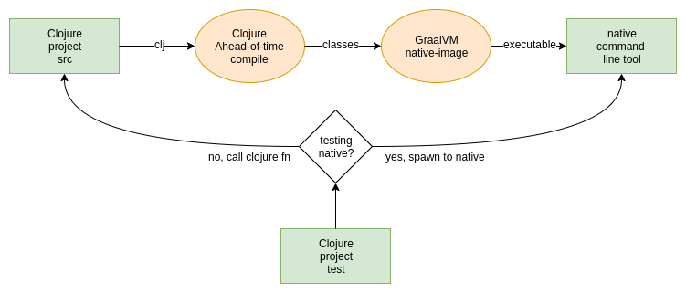

# Clojure GraalVM Testing Strategies

Your Clojure project likely has a suite of tests. Here we explore options
for ensuring your tests also work against your code after it has been natively
compiled with GraalVM.

## Conditional Spawning

This strategy works well when developing a command line tool.

Clojure project source is AOT compiled to classes then natively compiled to
an executable with GraalVM. The executable, in this case, is the command line
tool.

The test suite is setup with a flag to either test Clojure source in the JVM or
against the executable. The suite is run from the JVM twice:

* once with the flag selecting to test against Clojure sources in the JVM
* a second time with the flag selecting to run each test against a spawn of the executable

Examples of this technique can be found in [clj-kondo](https://github.com/borkdude/clj-kondo/blob/875a6bcf660fab60e3037b862edcab23dbc6124a/test/clj_kondo/test_utils.clj#L121)
and [jet](https://github.com/borkdude/jet/blob/92e186a020193645fbca5832b07c5d7c21ef9182/test/jet/test_utils.clj#L19).

## Test Compilation

This strategy could be considered when developing a Clojure library and wanting
to make efforts to ensure it also works when natively compiled with GraalVM.

In this scenario you run your Clojure tests as normal but complement them with
another run from a test runner executable created by GraalVM.

The test runner could be written by hand or automatically generated. It explicitly
requires all test namespaces, this way they will be automatically included
during AOT compilation and hence into the test runner executable.

An example of the test compilation technique can be found in
[rewrite-cljc-playground](https://github.com/lread/rewrite-cljc-playground/blob/master/script/pure_native_test.clj)
(soon to be rewrite-cljc). It is currently running successfully within the RAM constraints of GitHub Actions
on macOS, Windows and Ubuntu. 

A note from the author:
> I spent a long while trying to get this running within the RAM constraints of free tier CI. Only after I enabled
[Clojure direct linking](../README.md#native-image-compilation-time) did Graal's `native-image` RAM consumption shrink
to work under GitHub Actions.

## Test Interpretation 

Although it offers no guarantees of consuming significantly less RAM, this strategy might be employed when you've 
exhausted every other avenue in natively compiling your tests within your imposed RAM constraints. 

This technique may also be interesting if you want to ensure your library works as expected when exposed via SCI, 
the [Small Clojure Interpreter](https://github.com/borkdude/sci). 

Here your library, and any necessary supporting test libraries, are compiled with GraalVM and your tests
are interpreted via SCI.

Some more details can be found over at [lread/sci-test](https://github.com/lread/sci-test). Be warned, sci-test
is currently rewrite-cljc specific and should only serve as an example. Rewrite-cljc's usage of this technique
[is available for study](https://github.com/lread/rewrite-cljc-playground/blob/master/script/sci_native_test.clj).
